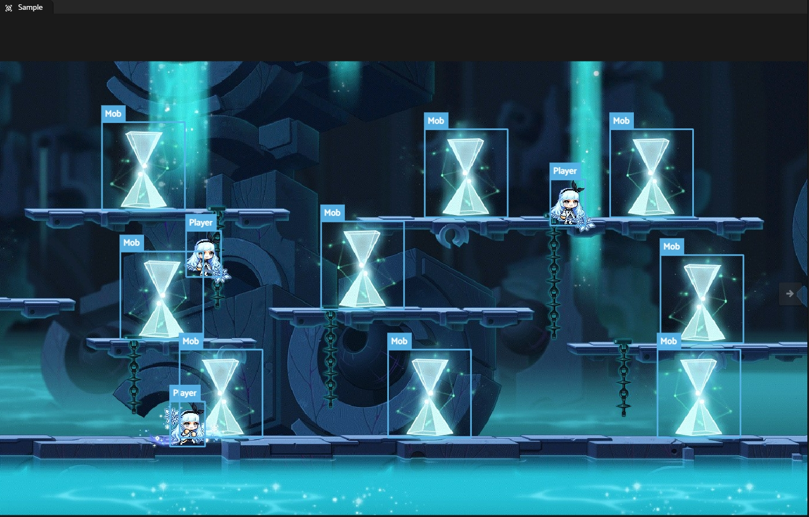
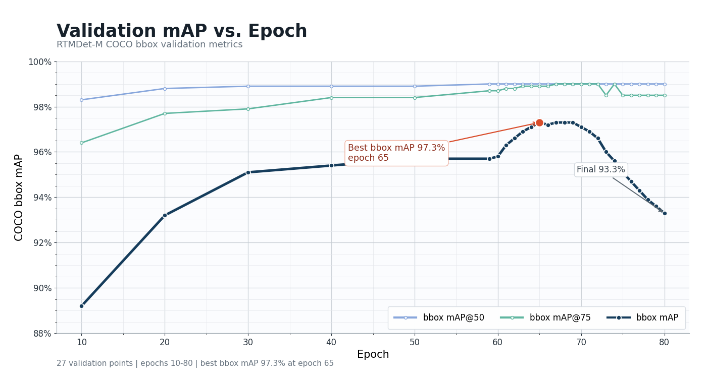

# MapleStoryDetectionSampleGenerator
Generate Machine Learning Samples Object Detection In MapleStory



# Performance
This generator can generate arbitrarily many annotated samples. All bounding boxes are precisely annotated based on rendering coordinates.

With [RTMDet](https://arxiv.org/abs/2212.07784) and ~10000 samples, it can achieve 97.3%mAP in test set.




# Requirement
* .NET 10.0 SDK (10.0.0 or above)

# Build
1. Clone this repository with submodules by </br> `git clone --recursive git@github.com:charlescao460/MapleStoryDetectionSampleGenerator.git`. </br>Note that `--recursive` is necessary.
2. Build `MapleStoryDetectionSampleGenerator.sln`
3. For `character` and `rune` modes, run `MapleStory.MachineLearningSampleGenerator\bin\Release\net10.0-windows7.0\WzComparerR2.exe` and open MapRender once. Running `WzComparerR2.exe` will generate `Setting.config`, which is required for our MapRender invoker. Geometry export reads WZ data directly and does not require this step.

# Run
(Assuming assemblies are built with `Release` configuration. `Debug` configuration is similar)
1. Use `WzComparerR2.exe` to find the desired map you want to sample. Assuming `993134200.img` is the map you want in Limina.
2. From the solution root, prepare a YAML config file. A checked-in example is available at `Examples\sample-generator.yml`.
3. If you want synthetic players, configure avatar WZ part IDs in the `player` post-processor. The generator renders player frames on the fly through `MapleStory.Avatar`.
4. Run `dotnet run --project .\MapleStory.MachineLearningSampleGenerator -- --config ".\Examples\sample-generator.yml"`</br>
You can run `.\MapleStory.MachineLearningSampleGenerator.exe --help` for usage hint, or execute the built binary directly with `--config <path>`. The config file is the single source of truth for maps, rendering, output, and post-processors.

Example YAML:
```yaml
mode: character
concurrency: 2

output:
  format: coco
  path: .
  name: sample-generator

render:
  width: 1366
  height: 768

sampling:
  count: 1000
  intervalMs: 0

postProcessors:
  - type: player
    count: 3
    actions: [stand1, walk1, jump]
    emotions: [default]
    avatars:
      - parts: [2000, 12003, 20000, 30000, 1040036, 1060026]
      - parts: [2000, 12003, 20000, 30000, 1040036, 1060026, 1703598]

maps:
  - id: 993134200
  - id: 450007010
    sampling:
      count: 2000
    postProcessors: []
```

Notes about the YAML format:
* `mode` is required. Use `character` for normal map/object samples, `rune` for rune-arrow keypoint samples, or `geometry` for Hecate map packs.
* `concurrency` is optional and controls how many map renders run at once. It defaults to `1`.
* `maps` is required. The legacy sequence form lists explicit map IDs, and each `id` should be the numeric map id without `.img`.
* Root `sampling` acts as the default for every rendered map. Root `postProcessors` acts as the default in `character` mode.
* `render.width`, `render.height`, `sampling`, and `output.name` are required in rendered modes. `sampling.count` controls how many uniformly random camera positions are sampled from each map.
* In rendered modes, a map-level `sampling` block overrides only the fields it sets.
* In `character` mode, a map-level `postProcessors` block replaces the root processor list. `postProcessors: []` disables inherited processors for that map.
* `player.count` is the number of generated player instances added to each sampled screenshot. It defaults to `3` when omitted.
* `player.avatars[].parts` is an ordered list of WZ part IDs. Later IDs replace earlier slot conflicts, matching the avatar generator behavior.
* Relative paths are resolved from the YAML file location.

Rune mode uses the same `render` and `sampling` sections, but requires `output.format: coco` and does not support `postProcessors`. Each output image is a center-square crop with four generated `rune_arrow` annotations and two COCO keypoints per arrow.

Rune mode can also randomly choose maps from all numeric `*.img` map nodes in the MapleStory data. Explicit entries are always included first; `random.count` adds that many additional maps and excludes duplicate explicit IDs. Add `seed` when you need repeatable selection.

Use `maps.allMaps: true` to process every numeric `*.img` map node. Explicit `entries` are still included first and are not duplicated. `allMaps` cannot be combined with `maps.random`; geometry mode supports `allMaps` but not `random`.

```yaml
mode: rune
output:
  format: coco
  path: ./rune-output
  name: rune-sample
render:
  width: 1366
  height: 768
sampling:
  count: 1000
  intervalMs: 0
maps:
  entries:
    - id: 410013660
  random:
    count: 50
    seed: 12345
```

# Note
* Since NPCs look like players, including them without annotation could result a negative effect on our model. Therefore, by default, we changed [WzComparerR2.MapRender/MapData.cs](https://github.com/Kagamia/WzComparerR2/blob/main/WzComparerR2.MapRender/MapData.cs) to prevent any NPC data loaded into map render when invoking from `MapleStory.MachineLearningSampleGenerator.exe`,

# Output Formats
## Tensorflow TFRecord
According to Tensorflow [official document](https://www.tensorflow.org/tutorials/load_data/tfrecord#tfrecords_format_details), the output .tfrecord contains multiple [tf.train.Example](https://www.tensorflow.org/api_docs/python/tf/train/Example) in single file. With each example store in the following formats:

```
uint64 length
uint32 masked_crc32_of_length
byte   data[length]
uint32 masked_crc32_of_data
```
And
```
masked_crc = ((crc >> 15) | (crc << 17)) + 0xa282ead8ul
```
Each `tf.train.Example` is generated by [protobuf-net](https://github.com/protobuf-net/protobuf-net) according to Tensorflow [example.proto](https://github.com/tensorflow/tensorflow/blob/master/tensorflow/core/example/example.proto)

## Darknet
Output directory structure:
```
data/
|---obj/
|   |---1.jpg
|   |---1.txt
|   |---......
|---obj.data
|---obj.names
|---test.txt
|---train.txt
```
`obj.data` contains 
```
classes=2
train=data/train.txt
valid=data/test.txt
names=data/obj.names
backup = backup/
```
And `obj.names` contains the class name for object. `test.txt` and `train.txt` contains samples for testing/training with ratio of 5:95 (5% of images in `obj/` are used for testing).

## COCO
Output directory structure:
```
coco/
|---train2017/
|   |---1.jpg
|   |---2.jpg
|   |---......
|---val2017/
|   |---1000.jpg
|   |---1001.jpg
|   |---......
|---annotations/
|   |---instances_train2017.json
|   |---instances_val2017.json
```
The COCO json is defined as following:
```json
{
  "info": {
    "description": "MapleStory 993134100.img Object Detection Samples - Training",
    "url": "https://github.com/charlescao460/MapleStoryDetectionSampleGenerator",
    "version": "1.0",
    "year": 2021,
    "contributor": "CSR"
  },
  "licenses": [
    {
      "url": "https://github.com/charlescao460/MapleStoryDetectionSampleGenerator/blob/main/LICENSE",
      "id": 1,
      "name": "MIT License"
    }
  ],
  "images": [
    {
      "license": 1,
      "file_name": "30a892e1-7f3d-4c65-bdd1-9d28f1ae5187.jpg",
      "coco_url": "",
      "height": 768,
      "width": 1366,
      "flickr_url": "",
      "id": 1
    },
    ...],
  "categories": [
    {
      "supercategory": "element",
      "id": 1,
      "name": "Mob"
    },
    {
      "supercategory": "element",
      "id": 2,
      "name": "Player"
    }
  ],
  "annotations": [
    {
      "segmentation": [
        [
          524,
          429,
          664,
          429,
          664,
          578,
          524,
          578
        ]
      ],
      "area": 20860,
      "iscrowd": 0,
      "image_id": 1,
      "bbox": [
        524,
        429,
        140,
        149
      ],
      "category_id": 1,
      "id": 1
    },
    ...]
```
Note that `segmentation` covers the area as the same as `bbox` does. No segmentation or masked implemented .

## Geometry Export
Hecate map geometry can be exported directly from WZ data without running the renderer or sampler. Geometry mode requires `output.format: geometry`; `render`, `sampling`, and `output.name` are optional and do not affect the pack, while `postProcessors` are not supported. Explicit map IDs are normalized, deduplicated, and exported in numeric order.

The exporter derives one Hecate geometry schema v2 JSON file and one PNG minimap canvas per map. It publishes a deterministic map-pack schema v1 manifest with maps and positive WZ versions sorted numerically. Repeating an export with the same geometry, minimaps, WZ versions, and producer version produces the same manifest and content-addressed filenames.

```yaml
mode: geometry
output:
  format: geometry
  path: ../../hecate/resources/map_geometry
maps:
  - id: 410000520
  - id: 410007014
  - id: 410007037
```

Run it with:

```powershell
dotnet run --project .\MapleStory.MachineLearningSampleGenerator -- --config .\Examples\hecate-geometry.yml
```

`map-pack.json` is the pack's mutable entry point. Each map entry names and pins the immutable geometry and minimap assets with lowercase SHA-256 values. `map_name` comes from String.wz and falls back to the numeric map ID when no name is available.

```json
{
  "schema_version": 1,
  "producer": {
    "name": "MapleStoryDetectionSampleGenerator",
    "version": "1.0.0.0"
  },
  "source": {
    "kind": "wz",
    "versions": [300]
  },
  "maps": [
    {
      "map_id": 410000520,
      "map_name": "Example map",
      "geometry_file": "410000520.<geometry-sha256>.json",
      "geometry_sha256": "<geometry-sha256>",
      "minimap_file": "410000520.<minimap-sha256>.png",
      "minimap_sha256": "<minimap-sha256>"
    }
  ]
}
```

The referenced geometry contains raw WZ map coordinates. Only non-zero horizontal footholds are emitted, with `x1 < x2`; ropes and ladders normalize `y1 <= y2` and use `kind: rope` or `kind: ladder`; and portals are emitted only when their destination is another portal in the same resolved map. Known portal types use their WZ symbolic name, while unknown types use their numeric value as a string.

```json
{
  "schema_version": 2,
  "map_id": 410000520,
  "map_name": "Example map",
  "minimap": {
    "center_x": 0,
    "center_y": 0,
    "mag": 4,
    "canvas_width": 800,
    "canvas_height": 600,
    "image": "410000520.<minimap-sha256>.png"
  },
  "platforms": [
    { "x1": -100, "x2": 100, "y": 20, "kind": "platform" }
  ],
  "ropes": [
    { "x": 0, "y1": -80, "y2": 20, "kind": "rope" }
  ],
  "portals": [
    { "x": -50, "y": 20, "dest_x": 50, "dest_y": 20, "type": "tp" }
  ]
}
```

Assets are published immutably before `map-pack.json` is atomically replaced. If any requested map fails, the existing manifest remains valid; unreferenced content-addressed files from an interrupted update may remain. Publication never clears the output directory, so prior hashed assets and Hecate-owned `*.alignment.json` sidecars are preserved.

Only `map-pack.json` and the geometry/minimap files it references belong in Hecate application resources. The generator executable, its DLLs, staging files, and source WZ data remain private build-time inputs and are not Hecate runtime dependencies. Consumers should read the manifest, verify both SHA-256 fields, and ignore unreferenced files.
